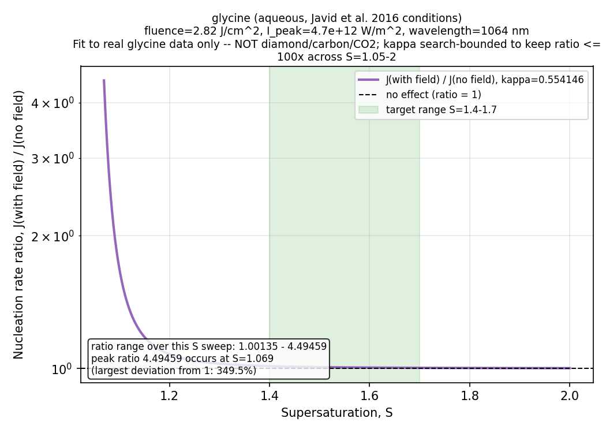
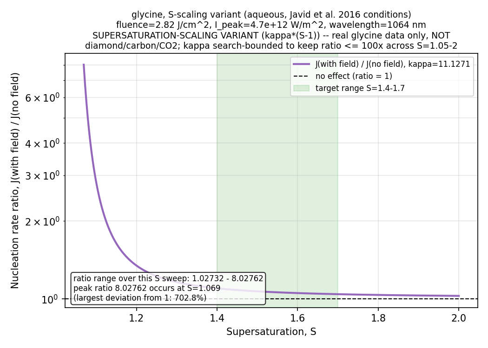
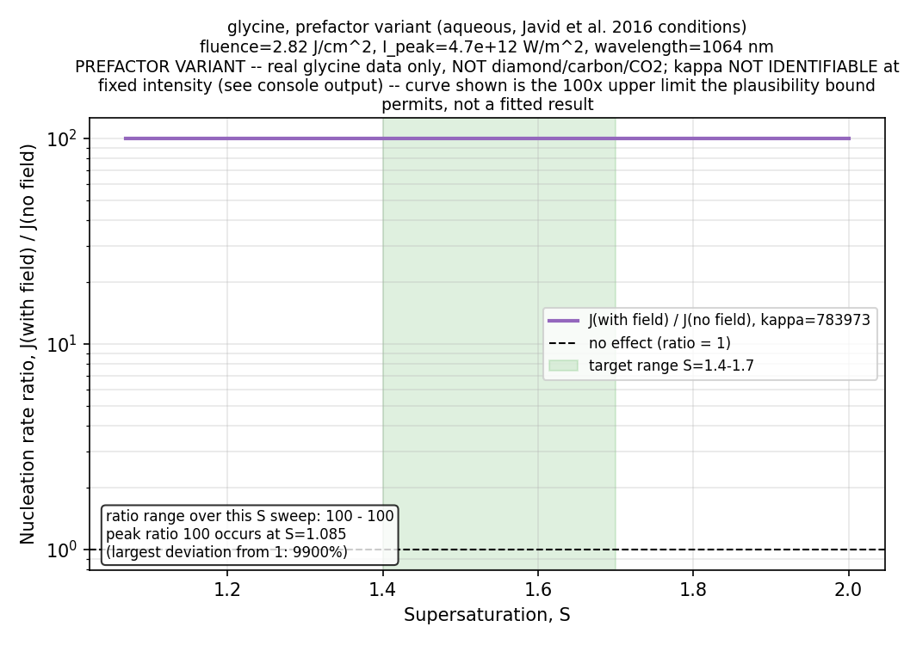
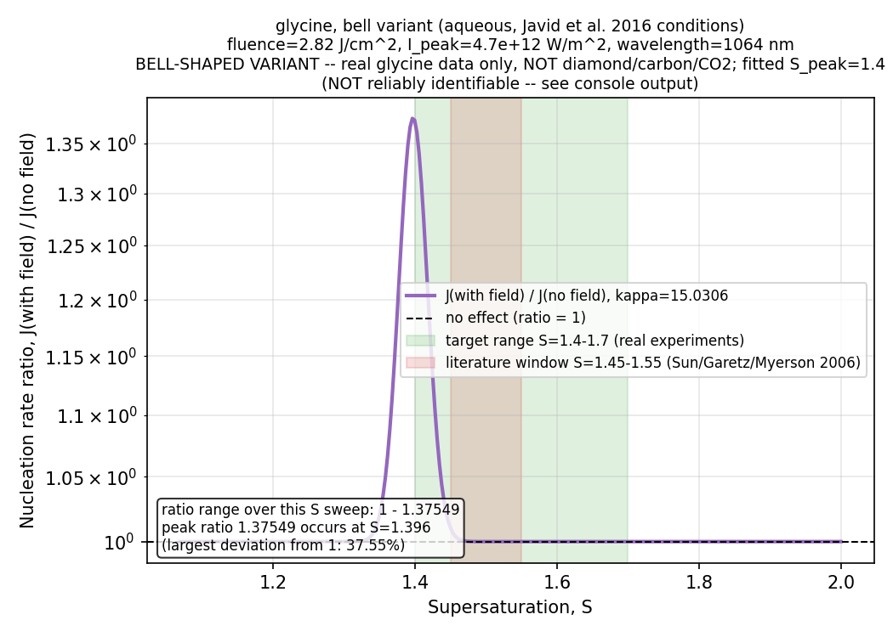
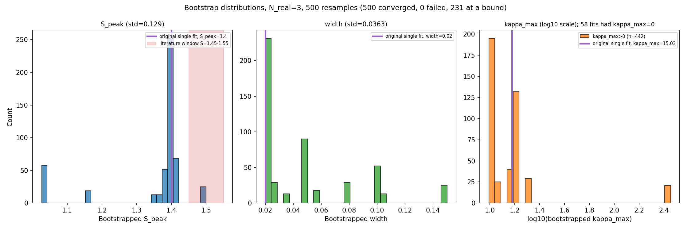
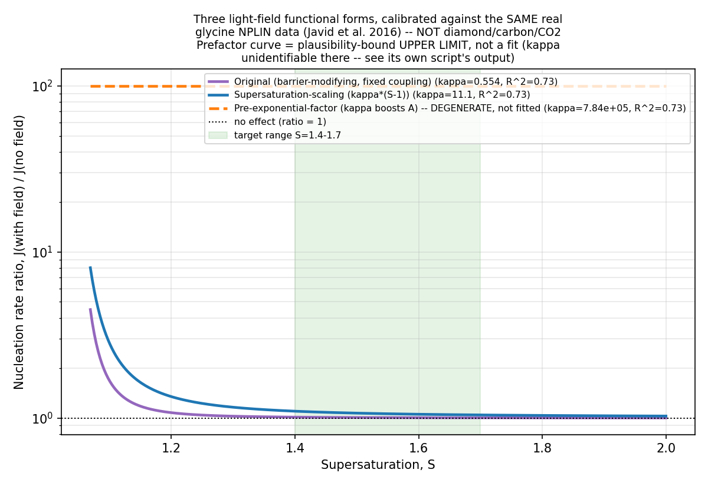
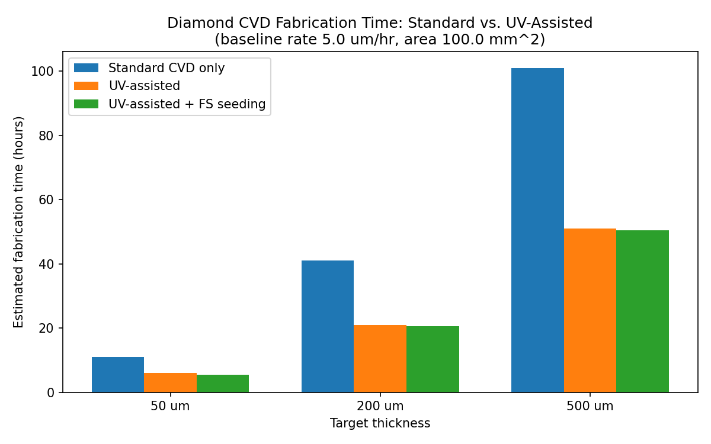
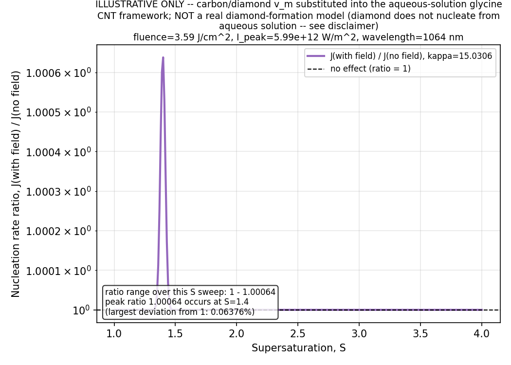

# The Journey: Building Diamonds With Light

*המסע: בניית יהלומים באמצעות אור · Le Voyage : Construire des Diamants avec la Lumière*

**Three days — שלושה ימים — Trois jours**

---

## Repository structure

- All `.py` model scripts live in the repository root (rerunnable standalone).
- [`glycine/`](glycine/) — real-data glycine NPLIN calibration plots (Javid et al. 2016).
- [`bell/`](bell/) — bell-shaped variant bootstrap/cross-validation outputs.
- [`kappa/`](kappa/) — light-field coupling (kappa) demo and side-by-side comparison plots.
- [`diamond/`](diamond/) — diamond CVD fabrication-time model outputs and the illustrative-only toy substitution figure.
- `LICENSE` — public-domain dedication (see declaration at the end of this document).

---

## 1.

The journey began three days ago with a single question: could light be used to build diamonds faster and better, honestly and efficiently? Not with hype, but with a model that could be checked against real data before trusting any of its numbers.

**עברית:** המסע הזה החל לפני שלושה ימים בשאלה אחת: האם ניתן להשתמש באור כדי לבנות יהלומים מהר יותר וטוב יותר, בכנות וביעילות? לא באמצעות התלהבות ריקה, אלא באמצעות מודל שניתן לבדוק מול נתונים אמיתיים לפני שסומכים על אף אחד מהמספרים שלו.

**Français :** Ce voyage a commencé il y a trois jours avec une seule question : la lumière pouvait-elle être utilisée pour fabriquer des diamants plus rapidement et mieux, honnêtement et efficacement ? Pas avec de l'enthousiasme creux, mais avec un modèle pouvant être vérifié face à des données réelles avant de faire confiance à l'un quelconque de ses chiffres.

## 2.

The first step was building a Classical Nucleation Theory simulator with a tunable light-field term, grounded in the real non-photochemical laser-induced nucleation (NPLIN) literature — Garetz, Myerson, and the 2016 Javid glycine dataset — so that any claim about light accelerating nucleation could be tested against numbers, not just intuition.

**עברית:** הצעד הראשון היה בניית סימולטור של תורת הגרעון הקלאסית (CNT) עם איבר שדה-אור הניתן לכיוון, המבוסס על ספרות אמיתית של גרעון מושרה בלייזר לא-פוטוכימי (NPLIN) — גרץ, מאיירסון, ומערך הנתונים של גליצין מ-2016 של ג'אוויד — כדי שכל טענה על האצת גרעון על ידי אור תיבדק מול מספרים, לא רק אינטואיציה.

**Français :** La première étape a consisté à construire un simulateur de théorie classique de la nucléation (CNT) avec un terme de champ lumineux ajustable, ancré dans la véritable littérature sur la nucléation induite par laser non photochimique (NPLIN) — Garetz, Myerson, et le jeu de données réel sur la glycine de Javid (2016) — afin que toute affirmation sur l'accélération de la nucléation par la lumière puisse être testée face à des chiffres, et non simplement à l'intuition.

*Original fixed-coupling model, calibrated to real glycine data (Javid et al. 2016).*

## 3.

Because the physical mechanism behind NPLIN is still debated, three alternative versions of the model were built: one where light lowers the nucleation barrier with a fixed coupling, one where that coupling grows with supersaturation, and one where light instead boosts the kinetic prefactor — three honest attempts to let the real data decide which idea, if any, held up.

**עברית:** מכיוון שהמנגנון הפיזיקלי מאחורי NPLIN עדיין שנוי במחלוקת, נבנו שלוש גרסאות חלופיות של המודל: אחת שבה האור מוריד את מחסום הגרעון עם צימוד קבוע, אחת שבה הצימוד הזה גדל עם רמת העל-רוויה, ואחת שבה האור במקום זאת מגביר את הגורם הקינטי המקדים — שלושה ניסיונות כנים לתת לנתונים האמיתיים להכריע איזו רעיון, אם בכלל, מחזיק מעמד.

**Français :** Comme le mécanisme physique derrière le NPLIN est toujours débattu, trois versions alternatives du modèle ont été construites : une où la lumière abaisse la barrière de nucléation avec un couplage fixe, une où ce couplage croît avec la sursaturation, et une où la lumière renforce plutôt le préfacteur cinétique — trois tentatives honnêtes de laisser les données réelles décider quelle idée, le cas échéant, tenait la route.

*Supersaturation-scaling variant: kappa grows with (S-1).*

*Pre-exponential-factor variant: kappa is mathematically degenerate with A at fixed intensity.*

## 4.

One of these variants — a bell-shaped, non-monotonic coupling — needed an extra layer of scrutiny, so a bootstrap and leave-one-out cross-validation script was built on top of it, and it surfaced an uncomfortable but important truth: with only three real calibration points, the fitted peak could not be reliably pinned down.

**עברית:** אחת מהגרסאות הללו — צימוד בצורת פעמון, לא-מונוטוני — דרשה שכבת בדיקה נוספת, ולכן נבנה מעליה סקריפט של בוטסטראפ ואימות הצלבה מסוג 'השאר-אחד-בחוץ', והוא חשף אמת לא נוחה אך חשובה: עם שלוש נקודות כיול אמיתיות בלבד, לא ניתן היה לקבוע באופן אמין את מיקום השיא המותאם.

**Français :** L'une de ces variantes — un couplage en forme de cloche, non monotone — nécessitait un niveau de contrôle supplémentaire ; un script de bootstrap et de validation croisée leave-one-out a donc été construit par-dessus, et il a révélé une vérité inconfortable mais importante : avec seulement trois points de calibration réels, le pic ajusté ne pouvait pas être déterminé de manière fiable.

*Bell-shaped (Gaussian-in-S) variant, single fit: S_peak = 1.4.*

*Bootstrap distributions (N_real=3, 500 resamples) showing S_peak is not reliably identifiable.*

## 5.

All three models were then run side by side against the exact same real glycine data, and the result was checked honestly rather than favorably: within the real experimental range of supersaturation (S = 1.4–1.7), none of the testable functional forms predicted an effect large enough to detect, and the third form turned out to be mathematically unidentifiable from this dataset altogether.

**עברית:** לאחר מכן הופעלו שלושת המודלים זה לצד זה מול אותם הנתונים האמיתיים בדיוק של גליצין, והתוצאה נבדקה בכנות ולא באופן מוטה: בטווח הניסויי האמיתי של רמת העל-רוויה (S = 1.4-1.7), אף אחת מהצורות הפונקציונליות הניתנות לבדיקה לא חזתה אפקט גדול מספיק כדי להיות ניתן לזיהוי, והצורה השלישית התבררה כבלתי-ניתנת-לזיהוי מתמטית מתוך מערך הנתונים הזה כלל.

**Français :** Les trois modèles ont ensuite été exécutés côte à côte face aux mêmes données réelles de glycine, et le résultat a été vérifié honnêtement plutôt que favorablement : dans la plage expérimentale réelle de sursaturation (S = 1,4-1,7), aucune des formes fonctionnelles testables n'a prédit un effet suffisamment grand pour être détectable, et la troisième forme s'est révélée mathématiquement non identifiable à partir de ce jeu de données.

*All three functional forms overlaid on the same real glycine data — the honest verdict.*

## 6.

With the light-field nucleation hypothesis honestly tested and found negligible, the journey turned toward diamond fabrication itself — but only by combining separately published, confirmed techniques (UV-laser-assisted growth, femtosecond-laser seeding, femtosecond-laser defect correction), deliberately keeping the disproven light-field mechanism out of the picture entirely.

**עברית:** לאחר שהשערת הגרעון על ידי שדה-אור נבדקה בכנות ונמצאה זניחה, המסע פנה לעבר ייצור יהלומים עצמו — אך רק באמצעות שילוב של טכניות מאושרות שפורסמו בנפרד (צמיחה בסיוע לייזר UV, זריעה בלייזר פמטושניה, תיקון פגמים בלייזר פמטושניה), תוך הקפדה מכוונת להשאיר את מנגנון שדה-האור שהופרך לגמרי מחוץ לתמונה לחלוטין.

**Français :** Une fois l'hypothèse de nucléation par champ lumineux honnêtement testée et jugée négligeable, le voyage s'est tourné vers la fabrication du diamant elle-même — mais uniquement en combinant des techniques confirmées et publiées séparément (croissance assistée par laser UV, ensemencement par laser femtoseconde, correction de défauts par laser femtoseconde), en gardant délibérément le mécanisme de champ lumineux réfuté totalement hors du tableau.

## 7.

A fabrication-time model was built to estimate how much faster a diamond part could be grown by chemical vapor deposition using these confirmed techniques together — clearly labeled as a projected estimate of a novel combination that no paper or prototype has actually built or tested.

**עברית:** נבנה מודל זמן-ייצור כדי להעריך עד כמה ניתן לגדל חלק יהלום מהר יותר בשיטת שיקוע אדים כימי תוך שימוש בטכניות המאושרות הללו יחד — מסומן בבירור כהערכה חזויה של שילוב חדשני שאף מאמר או אבטיפוס לא באמת בנה או בדק בפועל.

**Français :** Un modèle de temps de fabrication a été construit pour estimer à quelle vitesse une pièce de diamant pourrait être cultivée par dépôt chimique en phase vapeur en utilisant ensemble ces techniques confirmées — clairement identifié comme une estimation projetée d'une combinaison inédite qu'aucun article ni prototype n'a réellement construite ou testée.

*Projected diamond CVD fabrication time: standard vs. UV-assisted vs. UV+FS-seeding.*

## 8.

One more experiment was run purely out of curiosity: substituting diamond's material properties into the same aqueous glycine nucleation framework, just to see the shape of the curve — and it was labeled, unambiguously, as illustrative only and not a real diamond-formation model, since diamond does not even nucleate from an aqueous solution. The result was a vanishingly small 0.06% effect, consistent with everything already learned.

**עברית:** ניסוי נוסף הופעל מתוך סקרנות בלבד: החלפת התכונות החומריות של היהלום באותה מסגרת גרעון גליצין מימי, רק כדי לראות את צורת העקומה — והוא סומן, ללא כל עמימות, כאילוסטרטיבי בלבד ולא כמודל אמיתי של היווצרות יהלום, מאחר שיהלום אפילו אינו מתגרען מתמיסה מימית. התוצאה הייתה אפקט זעיר של 0.06%, בהתאמה מלאה עם כל מה שכבר נלמד.

**Français :** Une expérience supplémentaire a été menée par pure curiosité : substituer les propriétés matérielles du diamant dans le même cadre de nucléation de la glycine aqueuse, simplement pour observer la forme de la courbe — et elle a été explicitement étiquetée comme purement illustrative et non comme un véritable modèle de formation du diamant, puisque le diamant ne nuclée même pas à partir d'une solution aqueuse. Le résultat a été un effet infime de 0,06 %, cohérent avec tout ce qui avait déjà été appris.

*Illustrative-only toy substitution (NOT a real diamond-formation model): 0.06% effect.*

## 9.

Three days in, the honest answer is this: light, at least through the free-energy-perturbation mechanism modeled here, does not measurably accelerate diamond nucleation — but real, already-published laser techniques can meaningfully speed up diamond growth itself, and that distinction, hard-won through testing rather than assumed, is the actual result of this journey.

**עברית:** לאחר שלושה ימים, התשובה הכנה היא זו: אור, לפחות דרך מנגנון הפרעת-האנרגיה-החופשית שמודל כאן, אינו מאיץ באופן מדיד את גרעון היהלום — אך טכניות לייזר אמיתיות שכבר פורסמו יכולות להאיץ באופן משמעותי את צמיחת היהלום עצמה, והבחנה זו, שהושגה בקושי דרך בדיקה ולא הונחה מראש, היא התוצאה האמיתית של המסע הזה.

**Français :** Après trois jours, la réponse honnête est la suivante : la lumière, du moins via le mécanisme de perturbation de l'énergie libre modélisé ici, n'accélère pas de manière mesurable la nucléation du diamant — mais de véritables techniques laser déjà publiées peuvent accélérer de façon significative la croissance du diamant elle-même, et cette distinction, obtenue difficilement par des tests plutôt que supposée, est le résultat véritable de ce voyage.

---

## Final Result / התוצאה הסופית / Résultat Final

The concrete, testable yield of this journey is this fabrication-time projection: combining confirmed UV-assisted growth with femtosecond-laser seeding on a standard microwave-plasma CVD process, at a baseline rate of 5 µm/hr over a 100 mm² area, cuts total fabrication time roughly in half across every target thickness tested — from 11.00 hours down to 5.50 hours at 50 µm, from 41.00 down to 20.50 hours at 200 µm, and from 101.00 down to 50.50 hours at 500 µm.

**עברית:** היבול הקונקרטי והניתן לבדיקה של המסע הזה הוא תחזית זמן-הייצור הזו: שילוב צמיחה מאושרת בסיוע UV עם זריעה בלייזר פמטושנייה בתהליך שיקוע אדים כימי סטנדרטי בפלזמת מיקרוגל, בקצב בסיס של 5 מיקרומטר לשעה על שטח של 100 מ"ר, מקצר את זמן הייצור הכולל בכמעט מחצית בכל עובי יעד שנבדק — מ-11.00 שעות ל-5.50 שעות בעובי 50 מיקרומטר, מ-41.00 ל-20.50 שעות בעובי 200 מיקרומטר, ומ-101.00 ל-50.50 שעות בעובי 500 מיקרומטר.

**Français :** Le résultat concret et vérifiable de ce voyage est cette projection du temps de fabrication : combiner une croissance confirmée assistée par UV avec un ensemencement par laser femtoseconde dans un procédé standard de dépôt chimique en phase vapeur par plasma micro-ondes, à un taux de base de 5 µm/h sur une surface de 100 mm², réduit le temps de fabrication total de près de moitié pour chaque épaisseur cible testée — de 11,00 heures à 5,50 heures pour 50 µm, de 41,00 à 20,50 heures pour 200 µm, et de 101,00 à 50,50 heures pour 500 µm.

*FINAL RESULT — projected diamond CVD fabrication time: standard vs. UV-assisted vs. UV+FS-seeding (baseline rate 5.0 µm/hr, area 100.0 mm²).*

Source: `diamond_cvd_fabrication_model.py` console output. Baseline 5.0 µm/hr, area 100.0 mm², nucleation baseline 1.0 hr (estimated). Projected estimate of a novel combination — not a measured or peer-reviewed result.

---

## Author's Declaration and Public-Domain / Prior-Art Dedication

I, **Elad David Levi**, being the author and originator of this work, make the following declaration:

1. **Declaration of Authorship and Originality.** I affirm that this work — including all associated text, data, source code, models, and figures — is my own original creation, and that it has not been copied, stolen, plagiarized, or otherwise misappropriated from any other person or entity.

2. **Waiver and Dedication to the Public Domain.** To the fullest extent permitted by applicable law, I hereby irrevocably waive, abandon, and dedicate to the public domain any and all copyright and neighboring or related rights that I hold in this work, worldwide, for the full term of such rights. This dedication is made freely, voluntarily, and without reservation, in the spirit and intent of established public-domain dedications such as the Creative Commons CC0 1.0 Universal Public Domain Dedication.

3. **Defensive Publication as Prior Art.** This work is hereby publicly and irrevocably disclosed as prior art, with the express intent that its contents — including the ideas, methods, models, and combinations of techniques described herein — enter the public domain and the state of the art, so that no person or entity may lawfully claim, patent, or otherwise assert exclusive rights over them on the basis of having originated them.

4. **Irrevocability and Free Expression.** This disclosure and dedication are made pursuant to, and in exercise of, my rights to free expression under applicable law, and are intended by me to be permanent and irrevocable once published. I do not consent to, and reserve no right to compel, the suppression, retraction, or removal of this disclosure. This declaration states solely my own irrevocable intent and consent as author, and does not purport to limit or override the independent legal rights or obligations of any third party or hosting platform.

5. **No Warranty.** This work is dedicated to the public domain and disclosed "as is," without warranty of any kind, express or implied, including without limitation any warranty of accuracy, merchantability, or fitness for a particular purpose.

Executed by the author, Elad David Levi.
